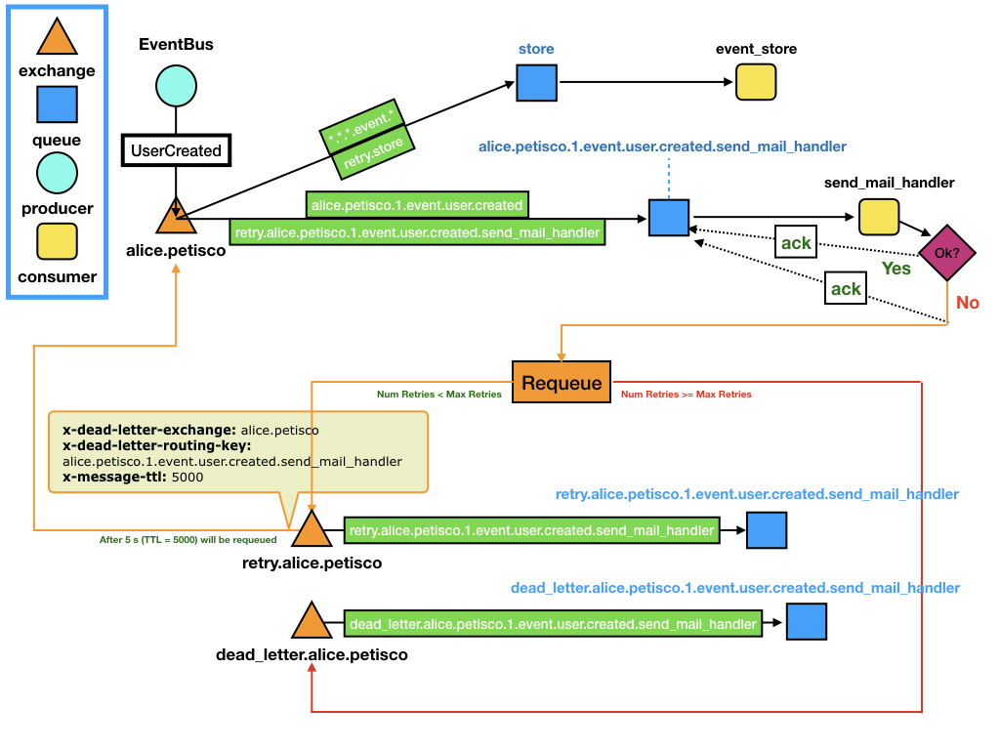
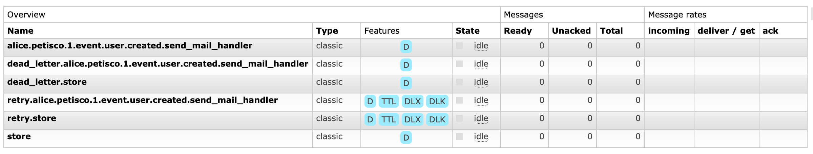

# EventBus :trolleybus:


## Getting Started

Let's image we are working for an organization (e.g `alice`) and developing a new service (e.g `petisco`). 

We want to publish an event when the user is created (`UserCreated`). 
This event will be consumed by:
 * **subscribers**: derived actions that are executed from associated events. 
 
In our example, we are going to use two subscribers:

* `event_store`: general subscriber. It can be useful for saving all events on Elastic, Prometheus, etc...
* `send_mail_handler`: It will send a mail on `UserCreated` event.

The following figure represents this use case:



What is happening here?

1. The `EventBus` publishes the `UserCreated` domain event. 
  * The routing key of this event is `alice.petisco.1.event.user.created` 
2. The exchange `alice.petisco` (*<organization>.<service>*) redirect the message using the binding keys (*green*)
3. The `store` queue receives the event perfectly :metal:
4. The `alice.petisco.1.event.user.created.send_mail_handler` queue gets the `UserCreated` event.
5. The `send_mail_handler` consumer obtains the event perform the action:
   * If it is success: perfect, everything works nice and the queue will get an `ack` :thumbsup:
   * Otherwise, if it is a failure: something is not working as expected or maybe we are suffering from overload. :fire:
      * We need to recover from error, let's `ack` to `alice.petisco.1.event.user.created.send_mail_handler` and requeue the info to the retry exchange (`retry.alice.petisco`).
      * We select a number of maximun retries, as well as the time between retries (`x-message-ttl` on `retry.alice.petisco.1.event.user.created.send_mail_handler`queue)
6. When the *TTL* expires on the retry queue, the message will be requeues automatically with the following parameters:
  * x-dead-letter-exchange: `alice.petisco`
  * x-dead-letter-routing-key`: `alice.petisco.1.event.user.created.send_mail_handler`
7. Then, the process will return to 2, however in this case, only will be requed to `alice.petisco.1.event.user.created.send_mail_handler` thanks to the additional binding key `retry.alice.petisco.1.event.user.created.send_mail_handler`.

## Queue Naming

The queues naming uses the following convention:

`<organization>.<service>.<version>.<type>.<event_name>.<action_handler>`
  
where:
* **organization** is used for represent your company/team/project
* **service** is used for represent your service/application
* **version** is used for represent the version of the source event/command
* **type** is used for represent the type of source that triggers the process (event|command)
* **event_name** is used to represent the name of the event in snake case (`UserCreate` -> `user.created`) 
* **action_handler** is used to represent the name of the callback which will trigger the event (e.g `send_mail_handler`) 

## Examples 

*"Show me this example working:exclamation:"* :raised_hand:

Ok, let's execute the following scripts :point_down:

If you haven't already done so, install petisco in your development environment:

```console
pip install petisco
```

Run a RabbitMQ  exchanges and queues with the following script:

```console
python examples/rabbitmq/configure.py
```

You can check your RabbitMQ  on `http://localhost:15672/` (guest:guest)

**Exchanges:**


**Queues:**


Then, you can start consuming events from queues with:

```console
python examples/rabbitmq/consume.py
```

Then, in another terminal, you can start publishing events:

```console
python examples/rabbitmq/publish.py
```


## Let's code

*"Show me the code:exclamation:"* :raised_hand:

Ok, there is the code :point_down:

##### Create a domain event
Create an `event` in petisco is as easy as:

```python
from petisco import Event, UserId

class UserCreated(Event):
    user_id: UserId

    def __init__(self, user_id: UserId):
        self.user_id = user_id
        super().__init__()


event = UserCreated(UserId.generate())
```

##### Configure RabbitMQ 
Now we need to configure subscribers on RabbitMQ. For example, we can use the `send_mail_handler` subscriber from the example below.

```python
from petisco import RabbitMqConnector, RabbitMqEventConfigurer, Event
from meiga import Result, Error, isSuccess, isFailure

connector = RabbitMqConnector()
organization = "alice"
service = "petisco"
retry_ttl = 5000 # default

configurer = RabbitMqEventConfigurer(connector, organization, service, retry_ttl=retry_ttl)

def send_mail_handler(event: Event) -> Result[bool, Error]:
  # Do your stuff here
  return isSuccess # if fails, returns isFailure

event = UserCreated(UserId.generate())

subscribers = [EventSubscriber(event, [send_mail_handler])]  
configurer.configure_subscribers(subscribers)
```

##### Start Consuming Events from RabbitMQ 

```python

organization = "alice"
service = "petisco"
max_retries = 5

connector = RabbitMqConnector()

consumer = RabbitMqEventConsumer(connector, organization, service, max_retries)

def send_mail_handler(event: Event) -> Result[bool, Error]:
  # Do your stuff here
  return isSuccess # if fails, returns isFailure

event = UserCreated(UserId.generate())
subscribers = [EventSubscriber(event, [send_mail_handler])]  

consumer.consume(subscribers)
consumer.start()
```

##### Publish Events with the EventBus


```python
connector = RabbitMqConnector()
organization = "alice"
service = "petisco"

bus = RabbitMqEventBus(connector, organization, service)

event = UserCreated()

bus.publish(event)
```
            
## Tricks

To prevent the propagation of Id parameters throughout your domain, you can compose your Event with a [`InfoId`](petisco/domain/aggregate_roots/info_id.py)

```python
user_created = UserCreated(user_id, name).add_info_id(info_id)
```

This will add `InfoId` information using the meta dictionary on message body. 
 
## Acknowledgments :ok_hand:

Thanks to [Dani](https://github.com/dgarcoe) for helping us with RabbitMQ and Queues Management. :metal:
Thanks to [CodelyTv](https://github.com/codelytv) for guiding us with such a good examples in their repositories. :rocket:
