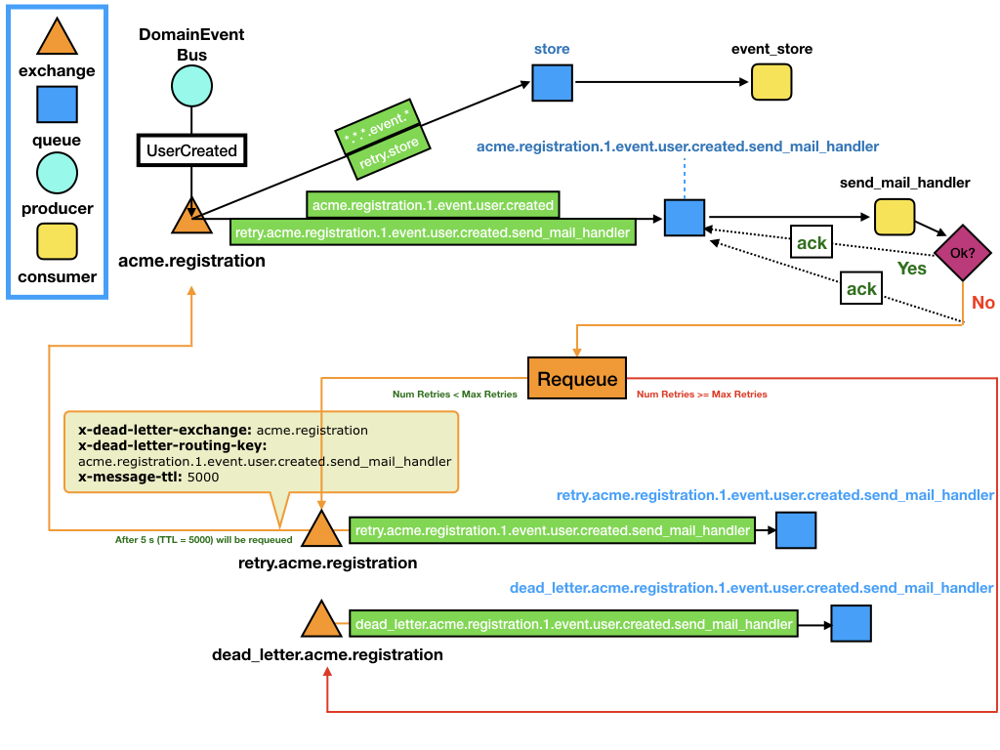

# Event Management :trolleybus:


## Getting Started

Let's imagine that we are developing a system for an organization (e.g `acme`) and we need a new service (e.g `registration`)
that by using an event and subscriber architecture will perform a simple user registration process.

We want to publish a domain event when the user create an account (`UserCreated`). 
The `registration` service will react to this event storing the date (metrics are important) and performing some 
derived action (e.g `send_mail_handler`).

This event will be consumed by:
 * **subscribers**: derived actions that are executed from associated events. 
 
In our example, we are going to use two subscribers:

* `event_store`: general subscriber. It can be useful for saving all domain events.
* `send_mail_handler`: It will send a mail on `UserCreated` event.

The following figure represents this use case:



What is happening here?

1. The `DomainEventBus` publishes the `UserCreated` domain event. 
   * The routing key of this event is `acme.registration.1.event.user.created` 
2. The exchange `acme.registration` (*<organization>.<service>*) redirect the message using the binding keys (*green*)
3. The `store` queue receives the event perfectly :metal:
4. The `acme.registration.1.event.user.created.send_mail_handler` queue gets the `UserCreated` event.
5. The `send_mail_handler` consumer obtains the event perform the action:
   * If it is success: perfect, everything works nice and the queue will get an `ack` :thumbsup:
   * Otherwise, if it is a failure: something is not working as expected or maybe we are suffering from overload. :fire:
      * We need to recover from error, let's `ack` to `acme.registration.1.event.user.created.send_mail_handler` and requeue the info to the retry exchange (`retry.acme.registration`).
      * We select a number of maximun retries, as well as the time between retries (`x-message-ttl` on `retry.acme.registration.1.event.user.created.send_mail_handler`queue)
6. When the *TTL* expires on the retry queue, the message will be requeues automatically with the following parameters:
   * x-dead-letter-exchange: `acme.registration`
   * x-dead-letter-routing-key: `acme.registration.1.event.user.created.send_mail_handler`
7. Then, the process will return to 2, however in this case, only will be requed to `acme.registration.1.event.user.created.send_mail_handler` thanks to the additional binding key `retry.acme.registration.1.event.user.created.send_mail_handler`.

## Queue Naming

The queues naming uses the following convention:

`<organization>.<service>.<version>.<type>.<event_name>.<action_handler>`
  
where:
* **organization** is used for represent your company/team/project
* **service** is used for represent your service/application
* **version** is used for represent the version of the source event/command
* **type** is used for represent the type of source that triggers the process (event|command)
* **event_name** is used to represent the name of the event in snake case (`UserCreate` -> `user.created`) 
* **action_handler** is used to represent the name of the callback which will trigger the event (e.g `send_mail_handler`) 

## Examples 

*"Show me this example working:exclamation:"* :raised_hand:

Ok, let's execute the following scripts :point_down:

If you haven't already done so, install `petisco` in your development environment:

```console
pip install petisco[rabbitmq]
```

Run a RabbitMQ  instance using default configuration:

```console
docker run -d --rm --name petisco-rabbitmq -p 5672:5672 -p 15672:15672 rabbitmq:3-management
```


Configure RabbitMQ  exchanges and queues with the following script:

```console
python examples/rabbitmq/configure.py
```

You can check your RabbitMQ  on `http://localhost:15672/` (guest:guest)

Then, you can start consuming events from queues with:

```console
python examples/rabbitmq/consume.py
```

Then, in another terminal, you can start publishing events:

```console
python examples/rabbitmq/publish_domain_events.py
```

or dispatch commands

```console
python examples/rabbitmq/dispatch_commands.py
```

## Available CLI 

Since version `v1.7.0`, petisco have available the cli command `petisco-rabbitmq` to consume domain events and requeue them.

Imagine you have some events in a dead letter queue. To reproduce, you can configure your rabbitmq and publish some 
events without launching a consumer. 

```console
python examples/rabbitmq/configure.py
python examples/rabbitmq/publish_domain_events.py
```

To requeue event from queues, just use the `petisco-rabbitmq`

```console
>> petisco-rabbitmq --help                                                                                                                                
usage: petisco-rabbitmq 🍪 [-h] [-rq] [-cq CONSUMING_QUEUES] [-o ORGANIZATION] [-s SERVICE] [-mr MAX_RETRIES] [-rttl RETRY_TTL] [-wtr WAIT_TO_REQUEUE]

petisco-rabbitmq helps us on rabbitmq iteration

optional arguments:
  -h, --help            show this help message and exit
  -rq, --requeue        requeue
  -cq CONSUMING_QUEUES, --consuming-queues CONSUMING_QUEUES
                        List of queues to consume split by commas (my-queue-1,my-queue-2)
  -o ORGANIZATION, --organization ORGANIZATION
                        Name of the organization
  -s SERVICE, --service SERVICE
                        Name of the service
  -mr MAX_RETRIES, --max-retries MAX_RETRIES
                        Max Retries
  -rttl RETRY_TTL, --retry-ttl RETRY_TTL
                        Retry TTL
  -wtr WAIT_TO_REQUEUE, --wait-to-requeue WAIT_TO_REQUEUE
                        Wait to Requeue (seconds)

```

Example:
```console
petisco-rabbitmq --requeue \
    --organization acme \
    --service registration \
    --consuming-queues dead_letter.acme.registration.1.event.user_confirmed.send_sms_on_user_confirmed,dead_letter.acme.registration.1.event.user_created.send_mail_on_user_created
```


## Let's code

*"Show me the code:exclamation:"* :raised_hand:

Ok, there is the code :point_down:

##### Create a domain event
Define a `DomainEvent` in petisco is as easy as:

```python
from petisco import DomainEvent, Uuid

class UserCreated(DomainEvent):
    user_id: Uuid

domain_event = UserCreated(user_id=Uuid.v4())
```

##### Configure RabbitMQ 

Now, you need to configure subscribers on RabbitMQ. For example, we can use the `send_mail_handler` subscriber from the example below.

```python
from petisco import DomainEvent, MessageSubscriber
from petisco.extra.rabbitmq import RabbitMqConnector, RabbitMqMessageConfigurer
from meiga import Result, Error, isSuccess, isFailure

def send_mail_handler(domain_event: DomainEvent) -> Result[bool, Error]:
  # Do your stuff here
  return isSuccess # if fails, returns isFailure

# Define Subscribers
domain_event = UserCreated(user_id=Uuid.v4())
subscribers = [MessageSubscriber.from_message(domain_event, [send_mail_handler])]  

# Configure RabbitMQ Infrastructure with defined subscribers
connector = RabbitMqConnector()
organization = "acme"
service = "registration"
configurer = RabbitMqMessageConfigurer(connector, organization, service)
configurer.configure_subscribers(subscribers)
```

##### Start Consuming DomainEvents from RabbitMQ 

```python
from petisco import MessageSubscriber
from petisco.extra.rabbitmq import RabbitMqConnector, RabbitMqMessageConsumer
from meiga import Result, Error, isSuccess, isFailure


def send_mail_handler(event: Event) -> Result[bool, Error]:
  # Do your stuff here
  return isSuccess # if fails, returns isFailure


# Define Subscribers
domain_event = UserCreated(user_id=Uuid.v4())
subscribers = [MessageSubscriber.from_message(domain_event, [send_mail_handler])]  

# Define RabbitMQ Consumer and start

organization = "alice"
service = "petisco"
max_retries = 5
connector = RabbitMqConnector()
consumer = RabbitMqMessageConsumer(connector, organization, service, max_retries)
consumer.add_subscribers(subscribers)
consumer.start()
```

##### Publish DomainEvents with the DomainEventBus


```python
from petisco.extra.rabbitmq import RabbitMqConnector, RabbitMqDomainEventBus

connector = RabbitMqConnector()
organization = "alice"
service = "petisco"
bus = RabbitMqDomainEventBus(connector, organization, service)

domain_event = UserCreated(user_id=Uuid.v4())

bus.publish(domain_event)
```

## Event Chaos (It is not migrated yet)

You can add a `IEventChaos` object as collaborator on a `RabbitMqConsumer`.
As example, petisco provides the `RabbitMqEventChaos` implementation, where configurable parameters are the following:

* percentage_simulate_nack: Percentage of simulate nack [0.0 -> 1.0]. Where 1.0 rejects all the event.
    - Configurable with `EVENT_CHAOS_PERCENTAGE_SIMULATE_NACK` envvar.
* delay_before_even_handler_second: Delay event handler execution for a given number of seconds.
    - Configurable with `EVENT_CHAOS_DELAY_BEFORE_EVENT_HANDLER_SECONDS` envvar.
* percentage_simulate_failures: Percentage of simulate failures [0.0 -> 1.0]. Where 1.0 simulate always a failure on handlers.
    - Configurable with `EVENT_CHAOS_PERCENTAGE_SIMULATE_FAILURES` envvar.    
* protected_routing_keys: Routing keys where chaos will not be applied  
    - Configurable with `EVENT_CHAOS_PROTECTED_ROUTING_KEYS` envvar (e.g `"dead_letter.store,dl-legacy"`).  
    

## Tricks (It is not migrated yet)

If you don't want to enable RabbitMq connection in some use case, you can use the following environment variable:

* `export PETISCO_EVENT_MESSAGE_BROKER="notimplemented"`


To prevent the propagation of Id parameters throughout your domain, you can compose your Event with a [`InfoId`](petisco/domain/aggregate_roots/info_id.py)

```python
user_created = UserCreated(user_id, name).add_info_id(info_id)
```

This will add `InfoId` information using the meta dictionary on message body. 
 
## Acknowledgments :ok_hand:

Thanks to [Dani](https://github.com/dgarcoe) for helping us with RabbitMQ and Queue Management. :ok_hand: :metal:

Thanks to [CodelyTv](https://github.com/codelytv) for guiding us with such a good examples in their repositories. :rocket:
