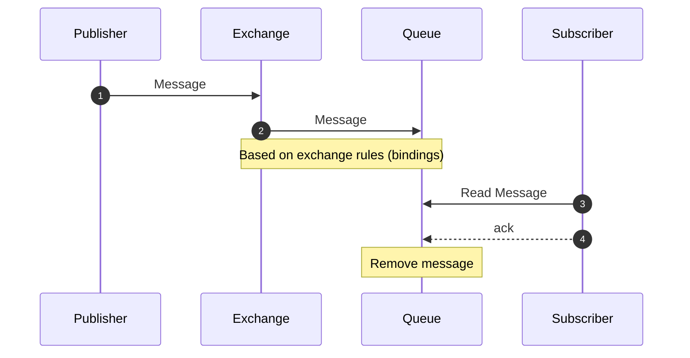
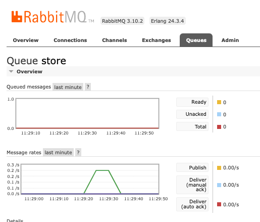
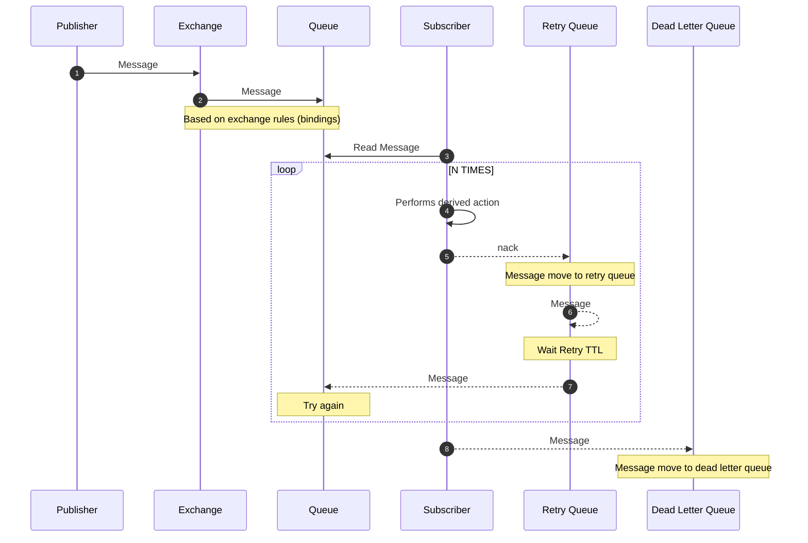
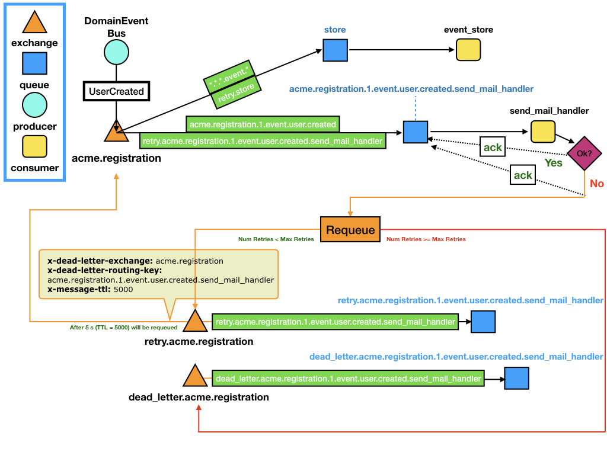

# petisco 🍪 | Message Broker 🚎


This page is an overview of how petisco helps us on Message Broker development. 


## Getting Started

> Hands-on examples to get you started with Petisco and RabbitMQ

Currently,
petisco provides a RabbitMQ implementation on top of [pika](https://github.com/pika/pika) framework.

### Terminology

This glossary joins domain ubiquitous language with the specific implementation using RabbitMQ.

* **Publisher:** Application (or application instance) that publishes messages (e.g domain events and commands). 
  Also called producer.
  * More info in: [https://www.rabbitmq.com/publishers.html](https://www.rabbitmq.com/publishers.html)
* **Message Broker:** Intermediary application that translates a message from the formal messaging protocol of the 
  sender (publisher/producer) to the formal messaging protocol of the receiver (subscriber/consumer). 
  * *Exchange:* "Messages are not published directly to a queue. Instead, the producer sends messages to an exchange. Exchanges are message routing agents, defined by the virtual host within RabbitMQ. An exchange is responsible for routing the messages to different queues with the help of header attributes, bindings, and routing keys."
    * More info in: [https://www.cloudamqp.com/blog/part4-rabbitmq-for-beginners-exchanges-routing-keys-bindings.html](https://www.cloudamqp.com/blog/part4-rabbitmq-for-beginners-exchanges-routing-keys-bindings.html)
  * *Queue:* "A queue is a sequential data structure with two primary operations: an item can be enqueued (added) at the tail and dequeued (consumed) from the head. Queues play a prominent role in the messaging technology space: many messaging protocols and tools assume that publishers and consumers communicate using a queue-like storage mechanism."
    * More info in: [https://www.rabbitmq.com/queues.html](https://www.rabbitmq.com/queues.html)
* **Subscriber:** Application (or application instance) that consumes messages (e.g domain events and commands) from a 
  queue and handles a derived action. Also called consumer or handler.

Find several RabbitMQ tutorials in [https://www.rabbitmq.com/getstarted.html](https://www.rabbitmq.com/getstarted.html).



### Try Petisco Message Broker examples using RabbitMQ 

In [examples/rabbitmq](examples/rabbitmq) you can find several scripts to interact with RabbitMQ.
To test how petisco can help you on message management you need to run locally a RabbitMQ application. 

1. **Run RabbitMQ with docker**.
    ```console
    docker run -d --rm --name petisco-rabbitmq -p 5672:5672 -p 15672:15672 rabbitmq:3-management
    ```
    You can check the RabbitMQ status on [http://localhost:15672/#/](http://localhost:15672/#/) (guest:guest). Please, 
    check the official doc [here](https://www.rabbitmq.com/download.html).
2. Create a python environment and install petisco
    ```console
    > python3 -m venv venv
    > source venv/bin/activate
    (venv) > pip install petisco[rabbitmq]
    ```
3. **Configure the exchanges and queues**. This script will configure common queues and specific queues to support subscriptions (domain event and command consumers/handlers).
    ```console
    python examples/rabbitmq/configure.py
    ```
4. **Start consuming messages from Queues**. This script will execute a continuous process to consume every message on subscribed queues. 
    ```console
    python examples/rabbitmq/consume.py
    ```
5. **Publish domain events**.
    ```console
    python examples/rabbitmq/publish_domain_events.py
    ```
6. **Dispatch commands**.
    ```console
    python examples/rabbitmq/dispatch_commands.py
    ```

These examples can help you to start playing with rabbitmq and to understand how it works in petisco. It is strongly 
recommended to check local rabbitmq at [http://localhost:15672/#/](http://localhost:15672/#/) (as mentioned above) to
review the activity of queues and exchanges.



In addition, there are three useful scripts (`clear.py`, `clear_subscribers.py`, `configure_with_clear_before.py`) for 
play with queue management and some administration tools for removing or renewing exchanges and queue configurations.

If you want to go deeper into how messages are queued in rabbitmq, you can review the concepts of `bindings`, `routing_keys` and `dead_letters`.


### RabbitMQ Configurations

Some configurations are managed by the classes and examples seen above, others can be configured with the following 
environment variables.

* `RABBITMQ_HEARTBEAT`: (default: 60 s)
* `RABBITMQ_USER`: (default: guest)
* `RABBITMQ_PASSWORD`: (default: guest)
* `RABBITMQ_HOST`: (default: localhost)
* `RABBITMQ_HOST`: (default: 5672)
* `RABBITMQ_CONNECTION_NUM_MAX_RETRIES`: (default: 15)
* `RABBITMQ_CONNECTION_WAIT_SECONDS_RETRY`: (default: 1)
* `RABBITMQ_MESSAGE_TTL`: (default 1000 ms) If a queue is already created it will generate a precodition failure.

## Available CLI 💻 

> Since version `v1.7.0`, petisco have available the cli command `petisco-rabbitmq` to consume domain events and requeue them.

Imagine you have some events in a dead letter queue. To reproduce, you can configure your rabbitmq and publish some 
events without launching a consumer. 

```console
python examples/rabbitmq/configure.py
python examples/rabbitmq/publish_domain_events.py
```

To requeue event from queues, just use the `petisco-rabbitmq`

```console
>> petisco-rabbitmq --help                                                                                                                                
usage: petisco-rabbitmq 🍪 [-h] [-rq] [-cq CONSUMING_QUEUES] [-o ORGANIZATION] [-s SERVICE] [-mr MAX_RETRIES] [-rttl RETRY_TTL] [-wtr WAIT_TO_REQUEUE]

petisco-rabbitmq helps us on rabbitmq iteration

optional arguments:
  -h, --help            show this help message and exit
  -rq, --requeue        requeue
  -o ORGANIZATION, --organization ORGANIZATION
                        Name of the organization
  -s SERVICE, --service SERVICE
                        Name of the service
  -cq CONSUMING_QUEUE, --consuming-queue CONSUMING_QUEUE
                        Queue to consume
  -rrk RETRY_ROUTING_KEY, --retry-routing-key RETRY_ROUTING_KEY
                        Routing key to republish the message to specific retry queue
  -ren RETRY_EXCHANGE_NAME, --retry-exchange-name RETRY_EXCHANGE_NAME
                        Exchange name to republish the message to specific exchange
  -mr MAX_RETRIES, --max-retries MAX_RETRIES
                        Max Retries
  -rttl RETRY_TTL, --retry-ttl RETRY_TTL
                        Retry TTL
  -wtr WAIT_TO_REQUEUE, --wait-to-requeue WAIT_TO_REQUEUE
                        Wait to Requeue (seconds)


```

Example 1 (requeue events from `dead_letter.acme.registration.1.event.user_confirmed.send_sms_on_user_confirmed`):

```console
petisco-rabbitmq --requeue \
    --organization acme \
    --service registration \
    --consuming-queue dead_letter.acme.registration.1.event.user_confirmed.send_sms_on_user_confirmed \
    --retry-routing-key retry.acme.registration.1.event.user_confirmed.send_sms_on_user_confirmed
```

Example 2 (requeue events from `dead_letter.acme.registration.1.event.user_created.send_mail_on_user_created`):

```console
petisco-rabbitmq --requeue \
    --organization acme \
    --service registration \
    --consuming-queue dead_letter.acme.registration.1.event.user_created.send_mail_on_user_created \
    --retry-routing-key retry.acme.registration.1.event.user_created.send_mail_on_user_created
```

Example 3 (requeue events from `dead_letter.store`):

```console
petisco-rabbitmq --requeue \
    --organization acme \
    --service registration \
    --consuming-queue dead_letter.store \
    --retry-routing-key retry.store	\
    --retry-exchange-name retry.acme.store
```

## Code 

> "Show me the code!" ✋

Base code is available in [petisco/domain/message](../../petisco/domain/message) and specific implementation in 
[petisco/extra/rabbitmq](../../petisco/extra/rabbitmq).

Some definition of key classes:


### Testing ✅

Best way to learn how to use petisco to manage messages is with the [examples](../../examples/rabbitmq) defined above 
and reviewing the petisco test suite (check these folders: [messages](../../tests/modules/base/domain/messages) and +
[rabbitmq](../../tests/modules/extra/rabbitmq)) 

You can run this tests using:
```console
lume -test-with-rabbitmq-mysql-and-elastic
```

> **Warning**
> Tests checks rabbitmq availability. If a local rabbitmq is not available, some tests will be skipped.  


### Code explained

* Create a domain event.
  Define a `DomainEvent` in petisco is as easy as:
    ```python
    from petisco import DomainEvent, Uuid
    
    class UserCreated(DomainEvent):
        user_id: Uuid
    
    domain_event = UserCreated(user_id=Uuid.v4())
    ```
* Configure RabbitMQ .
  Now, you need to configure subscribers on RabbitMQ. For example, we can use the `send_mail_handler` subscriber from the example below.
    
  ```python
    from petisco import DomainEvent, MessageSubscriber
    from petisco.extra.rabbitmq import RabbitMqConnector, RabbitMqMessageConfigurer
    from meiga import Result, Error, isSuccess, isFailure
    
    def send_mail_handler(domain_event: DomainEvent) -> Result[bool, Error]:
      # Do your stuff here
      return isSuccess # if fails, returns isFailure
    
    # Define Subscribers
    domain_event = UserCreated(user_id=Uuid.v4())
    subscribers = [MessageSubscriber.from_message(domain_event, [send_mail_handler])]  
    
    # Configure RabbitMQ Infrastructure with defined subscribers
    connector = RabbitMqConnector()
    organization = "acme"
    service = "registration"
    configurer = RabbitMqMessageConfigurer(connector, organization, service)
    configurer.configure_subscribers(subscribers)
    ```
* Start Consuming DomainEvents from RabbitMQ 
    ```python
    from petisco import MessageSubscriber
    from petisco.extra.rabbitmq import RabbitMqConnector, RabbitMqMessageConsumer
    from meiga import Result, Error, isSuccess, isFailure
    
    def send_mail_handler(event: Event) -> Result[bool, Error]:
      # Do your stuff here
      return isSuccess # if fails, returns isFailure
    
    # Define Subscribers
    domain_event = UserCreated(user_id=Uuid.v4())
    subscribers = [MessageSubscriber.from_message(domain_event, [send_mail_handler])]  
    
    # Define RabbitMQ Consumer and start
    organization = "alice"
    service = "petisco"
    max_retries = 5
    connector = RabbitMqConnector()
    consumer = RabbitMqMessageConsumer(connector, organization, service, max_retries)
    consumer.add_subscribers(subscribers)
    consumer.start()
    ```
* Publish DomainEvents with the DomainEventBus
    ```python
    from petisco.extra.rabbitmq import RabbitMqConnector, RabbitMqDomainEventBus
    
    connector = RabbitMqConnector()
    organization = "alice"
    service = "petisco"
    bus = RabbitMqDomainEventBus(connector, organization, service)
    
    domain_event = UserCreated(user_id=Uuid.v4())
    
    bus.publish(domain_event)
    ```

## Advanced 

> Let's go deeper...

Happy path of a message broker is shown in the following diagram. 
Let's imagine a new service (`registration`) which produces domain events and some actions are derived from them 
(managed by subscribers).


```mermaid
sequenceDiagram
    participant Publisher
    participant Exchange
    participant Queue
    participant Subscriber
		
	autonumber		
    Publisher->>Exchange: UserCreated
    Exchange->>Queue: UserCreated
	Subscriber->>Queue: Read Message
	Subscriber->>Subscriber: Send SMS to user
    Subscriber-->>Queue: ack
	Note over Queue: Remove message
	Note over Publisher, Subscriber: Registration Example
```

However, when something is not correct on the subscriber, petisco/rabbitmq infrastructure performs some actions to 
retry the execution. This will be the steps:
1. Subscriber read the message from queue (e.g UserCreated)
2. Subscriber perform derived fails (e.g send sms message when user is created)
3. As this derived action fails, subscriber returns a `nack` to the queue.
4. Now, the message is requeued to the `retry` queue.
   * This waits a specific time (ttl) and message will be requeued n times (also configurable).
5. If derived action is not a success, message will be requeue to a `dead letter` queue.




### Queue Naming

The queues naming uses the following convention:

`<organization>.<service>.<version>.<type>.<event_name>.<action_handler>`
  
where:
* **organization** is used for represent your company/team/project
* **service** is used for represent your service/application
* **version** is used for represent the version of the source event/command
* **type** is used for represent the type of source that triggers the process (event|command)
* **event_name** is used to represent the name of the event in snake case (`UserCreate` -> `user.created`) 
* **action_handler** is used to represent the name of the callback which will trigger the event (e.g `send_mail_handler`) 

### How petisco takes advantage of RabbitMQ

Continuing with the `registration` example: imagine we are developing this system for an organization called `acme`).

We want to publish a domain event when the user create an account (`UserCreated`). 
The `registration` service will react to this event storing the date (metrics are important) and performing some 
derived action (e.g `send_mail_handler`). This event will be consumed by subscribers (derived actions that are executed 
from associated events).
 
In our example, we are going to use two subscribers:

* `event_store`: general subscriber. It can be useful for saving all domain events.
* `send_mail_handler`: It will send a mail on `UserCreated` event.

The following figure represents this use case:



What is happening here?

1. The `DomainEventBus` publishes the `UserCreated` domain event. 
   * The routing key of this event is `acme.registration.1.event.user.created` 
2. The exchange `acme.registration` (*<organization>.<service>*) redirect the message using the binding keys (*green*)
3. The `store` queue receives the event perfectly :metal:
4. The `acme.registration.1.event.user.created.send_mail_handler` queue gets the `UserCreated` event.
5. The `send_mail_handler` consumer obtains the event perform the action:
   * If it is success: perfect, everything works nice and the queue will get an `ack` :thumbsup:
   * Otherwise, if it is a failure: something is not working as expected or maybe we are suffering from overload. :fire:
      * We need to recover from error, let's `ack` to `acme.registration.1.event.user.created.send_mail_handler` and requeue the info to the retry exchange (`retry.acme.registration`).
      * We select a number of maximun retries, as well as the time between retries (`x-message-ttl` on `retry.acme.registration.1.event.user.created.send_mail_handler`queue)
6. When the *TTL* expires on the retry queue, the message will be requeues automatically with the following parameters:
   * x-dead-letter-exchange: `acme.registration`
   * x-dead-letter-routing-key: `acme.registration.1.event.user.created.send_mail_handler`
7. Then, the process will return to 2, however in this case, only will be requed to `acme.registration.1.event.user.created.send_mail_handler` thanks to the additional binding key `retry.acme.registration.1.event.user.created.send_mail_handler`.

## Event Chaos (It is not migrated yet)

You can add a `IEventChaos` object as collaborator on a `RabbitMqConsumer`.
As example, petisco provides the `RabbitMqEventChaos` implementation, where configurable parameters are the following:

* percentage_simulate_nack: Percentage of simulate nack [0.0 -> 1.0]. Where 1.0 rejects all the event.
    - Configurable with `EVENT_CHAOS_PERCENTAGE_SIMULATE_NACK` envvar.
* delay_before_even_handler_second: Delay event handler execution for a given number of seconds.
    - Configurable with `EVENT_CHAOS_DELAY_BEFORE_EVENT_HANDLER_SECONDS` envvar.
* percentage_simulate_failures: Percentage of simulate failures [0.0 -> 1.0]. Where 1.0 simulate always a failure on handlers.
    - Configurable with `EVENT_CHAOS_PERCENTAGE_SIMULATE_FAILURES` envvar.    
* protected_routing_keys: Routing keys where chaos will not be applied  
    - Configurable with `EVENT_CHAOS_PROTECTED_ROUTING_KEYS` envvar (e.g `"dead_letter.store,dl-legacy"`).  
    

# Acknowledgments 👌

* Thanks to [Dani](https://github.com/dgarcoe) for helping us with RabbitMQ and Queue Management. 👌 🤘
* Thanks to [CodelyTv](https://github.com/codelytv) for guiding us with such a good examples in their repositories. 🚀
