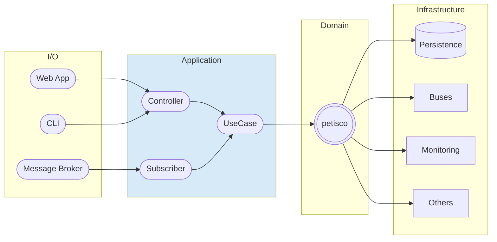
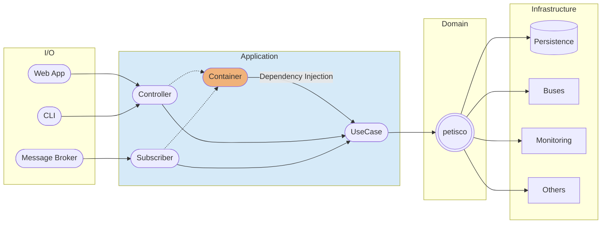
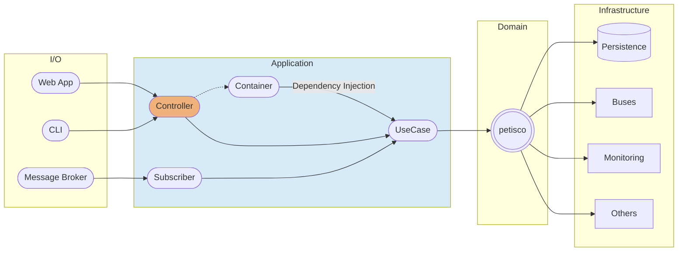
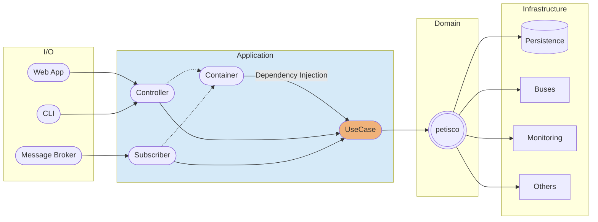
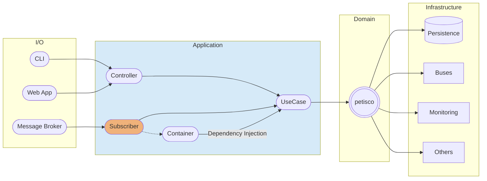

Let's go deeper into the application layer.



## Dependency Injection Container

The framework provides a Dependency Injection Container to manage instantiation of dependencies.



As we presented in the [Getting Started](getting_started.md) section. The dependencies will be configured in the `Container` when `Aplication` is configured.

??? example

    Accessing the container to instantiate its dependencies is as easy as following:

    ```python
    from petisco import Container

    my_instance = Container.get("name-of-my-dependency")  

    # You can check available dependencies
    available_dependencies: list[str] = Container.get_available_dependencies()
    ```

    To configure dependencies manually, use `set_dependencies`:

    ```python
    from petisco import Container

    dependencies = [Dependency(name="name-of-my-dependency", default_builder=Builder(MyDependencyObjectType))]    
    Container.set_dependencies(dependencies)
    my_instance: MyDependencyObjectType = Container.get("name-of-my-dependency")
    ```
    

## Controller

Use `Controller` class to define and configure inputs and outputs or your entry point.



??? example

    You can use a simpler and default configuration:
    ```python
    from petisco import Controller
    from meiga import Result, Success, Error
    import random
    
    class MyController(Controller):
        def execute(self) -> Result[bool, Error]:
            return Success(random.choice([True, False]))
    ```
    
    Or define some configurations using the inner class `Config` (e.g. add `middlewares`).
    
    ```python
    from petisco import DomainError, Controller, PrintMiddleware
    from meiga import Result, Success, Error
    import random
    
    class MyError(DomainError): ...
    
    class MyController(Controller):
        class Config:
            middlewares = [PrintMiddleware]
    
        def execute(self) -> Result[bool, Error]:
            return Success(random.choice([True, False]))
    ```

### Middlewares

Middlewares are a layer of action that are wrapped around a piece of core logic in an application (in this case, the `Controller`)

`petisco` provides some examples of Middlewares:

| Middleware                                     | Definition                                                  | 
|------------------------------------------------|:------------------------------------------------------------| 
| `PrintMiddleware`                              | Print something before and after the controller             | 
| `NotifierMiddleware`                           | Notify a message if the result of a controller is a failure |

To create your Middleware is necessary to extend from `Middleware`.

??? example

    ```python
    from meiga import Result
    
    from petisco.base.application.middleware.middleware import Middleware
    
    
    class PrintMiddleware(Middleware):
        def before(self):
            print(
                f"{self.wrapped_class_name} -> Start | Params {dict(self.wrapped_class_input_arguments)}"
            )
    
        def after(self, result: Result):
            print(f"{self.wrapped_class_name} -> End | {result}")
    ```

??? note

    If you want to set a default middleware for every Controller, you can use the envvar `PETISCO_DEFAULT_MIDDLEWARES`:

    - `PETISCO_DEFAULT_MIDDLEWARES=PrintMiddleware`: to configure PrintMiddleware
    - `PETISCO_DEFAULT_MIDDLEWARES=NotifierMiddleware`: to configure NotifierMiddleware
    - `PETISCO_DEFAULT_MIDDLEWARES=PrintMiddleware,NotifierMiddleware`: to configure several middlewares (using comma to separate)

### Success Handler

On one hand, you can modify the result of a controller when the result is a success with the `success_handler` Config argument.

??? example

    ```python
    from petisco import DomainError, Controller, PrintMiddleware
    from meiga import Result, Success, Error
    import random
    
    class MyError(DomainError): ...
    
    class MyController(Controller):
        class Config:
            middlewares = [PrintMiddleware]
            success_handler = lambda result: {"message": f"MyController set {result}", "detail": "whatever"} 
            
        def execute(self) -> Result[bool, Error]:
            return Success(random.choice([True, False]))
    ```

### Failure Handler

On the other hand, you can modify the result of the controller when failure. you can use the `error_map` 

??? example

    ```python
    from petisco import DomainError, Controller, PrintMiddleware, HttpError
    from meiga import Result, Success, Failure, Error
    import random
    
    class MyError(DomainError): ...
    
    class MyController(Controller):
        class Config:
            middlewares = [PrintMiddleware]
            error_map = {MyError: HttpError(status_code=400, detail="Random error")}
    
        def execute(self) -> Result[bool, Error]:
            if random.choice([True, False]) is False:
                return Failure(MyError())
            return Success(True)
    ```

If you want to further customize the result you can use the `failure_handler`:

??? example

    ```python
    from petisco import DomainError, Controller, PrintMiddleware
    from meiga import Result, Success, Failure, Error
    import random
    
    class MyError(DomainError): ...
    
    class MyController(Controller):
        class Config:
            middlewares = [PrintMiddleware]
            failure_handler = lambda result: {"message": f"MyController error {result}", "detail": "random error"} 
    
        def execute(self) -> Result[bool, Error]:
            if random.choice([True, False]) is False:
                return Failure(MyError())
            return Success(True)
    ```

### Example 

A controller is class which receive inputs from the infrastructure layer (web framework, cli, etc...) and orchestrate 
the application use cases given a result.

```python
from meiga import BoolResult
from petisco import Controller, Container
from pydantic import BaseModel, constr
from my_app import TaskCreator

class Task(BaseModel):
    name: constr(max_length=50)
    description: constr(max_length=200)

class CreateTaskController(Controller):
    def execute(self, task: Task) -> BoolResult:
        # Instantiate the use case and inject dependencies from Container
        task_creator = TaskCreator(
            repository=Container.get("task_repository"),
            domain_event_bus=Container.get("domain_event_bus"),
        )
        return task_creator.execute(task=task)    

def create_task(task: Task):
    return CreateTaskController().execute(task)

# Example calling the controller from a script
if __name__ == '__main__':
    task = Task(name="petisco", description="Learning petisco is nice!")
    result = create_task(task)
    print(result)
```

??? tip "Example with FastAPI"

    To use it in combination with FastAPI is as easy as inherit from  `FastAPIController` instead of using `Controller`:  

    ```python
    from typing import Type
    from fastapi import FastAPI
    from meiga import BoolResult, isSuccess
    from petisco.extra.fastapi import FastAPIController
    from pydantic import BaseModel
    from pydantic.types import constr
    from petisco import CommandSubscriber, Command, Container, CommandBus
    from my_app import CreateTask, TaskCreator
    
    app = FastAPI()
    
    
    class Task(BaseModel):
        name: constr(max_length=50)
        description: constr(max_length=200)
    
    
    # Controller
    class CreateTaskController(FastAPIController):
        def execute(self, task: Task) -> BoolResult:
            command_bus: CommandBus = Container.get("command_bus")
            create_task = CreateTask.from_task(task)
            command_bus.dispatch(create_task)
            return isSuccess
    
    
    # Subscriber
    class CreateTaskOnCreateTaskCommandSubscriber(CommandSubscriber):
    
        def subscribed_to(self) -> Type[Command]:
            return CreateTask
    
        def handle(self, command: Command) -> BoolResult:
            task = Task.from_command(command)
            task_creator = TaskCreator(
                repository=Container.get("task_repository"),
                domain_event_bus=self.domain_event_bus,
                # Use available domain_event_bus in CommandSubscriber instead of Container.get("domain_event_bus")
            )
            return task_creator.execute(task=task) 
    
    
    @app.post("/task")
    def create_task(task: Task):
        return CreateTaskController().execute(task)


    ```

## Use Case

The use case is a class that solves a part of your business logic. 



As shown in the diagram above, a `UseCase` will be instantiated by a `Controller` or/and  a `Subscriber`. 
Both will use the `Container`, to inject the dependencies.

??? example "Example of TaskCreator (instantiated in the Controller Example)"

    Following the Task Manager application example, there ir a `TaskCreator` that saves the task through a repository 
    and publishes a domain event using an event bus. The code could be as follow:
    
    ```python 
    from meiga import BoolResult, isSuccess
    from petisco import CrudRepository, DomainEventBus, UseCase
    
    from my_app import Task
    
    class TaskCreated(DomainEvent): ...
    
    class TaskCreator(UseCase):
        def __init__(
            self,
            repository: CrudRepository,
            domain_event_bus: DomainEventBus,
        ):
            self.repository = repository
            self.domain_event_bus = domain_event_bus
    
        def execute(self, task: Task) -> BoolResult:
            self.repository.save(task).unwrap_or_return()
            self.domain_event_bus.publish_list(TaskCreated())
            return isSuccess
    ```

## Subscriber

A `Subscriber` is similar to `Controller`, use it to define and configure inputs and outputs or your entry point.
The difference is that the `Subscriber` is executed reactively to messages (Domain Events, Commands, etc..).




`Subscribers` (or handlers) are very useful on Event Streaming Architectures, where use cases publish domain events and
subscribers handle them.

### Subscribe to all messages

If you want to create a subscriber to handle all the message, you have to extend from `AllMessageSubscriber`.

??? example

    ```python
    from petisco import AllMessageSubscriber, Message, Container
    from meiga import BoolResult
    from my_app import MessageSaver
    
    class StoreMessage(AllMessageSubscriber):
        def handle(self, message: Message) -> BoolResult:
            saver = MessageSaver(repository=Container.get("message_repository"))
            return saver.save(message)
    ```
    
    In this example, the subscriber will handle all the messages and store them into a configured repository.

### Subscribe to a DomainEvent

You can subscribe to domain events (check [Domain](domain.md) to learn how to create a domain event).

??? example "Example subscribing to 1 Domain Event"

    ```mermaid
    flowchart LR
    
            subgraph Use Case TaskCreator
            eventbus([Event Bus])
            end
            
            message_broker([Message Broker])
            eventbus -- Domain Event --> message_broker
            message_broker --  Domain Event --> Subscriber

            subgraph Use Case Send Notification 
            action([Action])
            end

            Subscriber --> action
                            
            style Subscriber fill:#D6EAF8
            
            style message_broker fill:#F0B27A,stroke:#333,stroke-width:2px
    ```

    ```python
    from petisco import DomainEventSubscriber, DomainEvent, Container
    from my_app import TaskCreated, Notification, Notificator

    class SendNotificationOnTaskCreated(DomainEventSubscriber):
        
        def subscribed_to(self) -> list[Type[DomainEvent]]:
            return [TaskCreated]
    
        def handle(self, domain_event: DomainEvent) -> BoolResult:
            notification = Notification.from_domain_event(domain_event)
            notificator = Notificator(app_service=Container.get("my_app_service"))
            return notificator.execute(notification)
    ```

??? example "Example subscribing to several Domain Events"

    ```mermaid
    flowchart LR
    
            subgraph Use Case TaskCreator
            eventbus1([Event Bus])
            end

            subgraph Use Case TaskUpdater
            eventbus2([Event Bus])
            end

            subgraph Use Case TaskRemover
            eventbus3([Event Bus])
            end
            
            message_broker([Message Broker])
            eventbus1 -- TaskCreated --> message_broker
            eventbus2 -- TaskUpdated --> message_broker
            eventbus3 -- TaskRemoved --> message_broker

            message_broker --  TaskCreated --> Subscriber
            message_broker --  TaskUpdated --> Subscriber
            message_broker --  TaskRemoved --> Subscriber 

            subgraph Use Case Send Notification 
            action([Action])
            end

            Subscriber --> action
                            
            style Subscriber fill:#D6EAF8
            
            style message_broker fill:#F0B27A,stroke:#333,stroke-width:2px
    ```

    ```python
    from typing import Type
    from petisco import DomainEventSubscriber, DomainEvent, Container
    from my_app import TaskCreated, TaskUpdated, TaskRemoved, Notification, Notificator

    class SendNotificationOnTaskModifications(DomainEventSubscriber):
        
        def subscribed_to(self) -> list[Type[DomainEvent]]:
            return [TaskCreated, TaskUpdated, TaskRemoved]
    
        def handle(self, domain_event: DomainEvent) -> BoolResult:
            notification = Notification.from_domain_event(domain_event)
            notificator = Notificator(app_service=Container.get("my_app_service"))
            return notificator.execute(notification)
    ```

### Subscribe to a Command

You can subscribe to a command that is published by your domain.

??? example

    ```python
    from typing import Type
    from petisco import CommandSubscriber, Command, Container
    from my_app import CreateTask, TaskCreator

    class CreateTaskOnCreateTaskCommand(CommandSubscriber):
        
        def subscribed_to(self) -> Type[Command]:
            return [CreateTask]
    
        def handle(self, command: Command) -> BoolResult:
            task = Task.from_command(command)
             task_creator = TaskCreator(
                repository=Container.get("task_repository"),
                domain_event_bus=self.domain_event_bus, # Use available domain_event_bus in CommandSubscriber instead of Container.get("domain_event_bus")
            )
            return task_creator.execute(task=task)  
    ```


!!! info
    For more info, take a look at [Infrastructure/RabbitMQ](extra/rabbitmq) and see how it works with a real implementation.


## CQRS

CQRS (Command Query Responsibility Segregation) is incipient in petisco, but the framework already allows to play with 
this architecture. 
The following example presents the cases we have reviewed in the previous sections. 
We will use a `Controller` to send a command over the command bus, so that a subscriber will receive this message and 
instantiates the use case in order to complete the action.


??? tip "CQRS example with FastAPI"

    ```python
    from typing import Type

    from fastapi import FastAPI
    from meiga import BoolResult, isSuccess
    from petisco.extra.fastapi import FastAPIController
    from pydantic import BaseModel
    from pydantic.types import constr
    from petisco import CommandSubscriber, Command, Container, CommandBus
    from my_app import CreateTask, TaskCreator
    
    app = FastAPI()
    
    
    class Task(BaseModel):
        name: constr(max_length=50)
        description: constr(max_length=200)
    
    
    # Controller
    class CreateTaskController(FastAPIController):
        def execute(self, task: Task) -> BoolResult:
            command_bus: CommandBus = Container.get("command_bus")
            create_task = CreateTask.from_task(task)
            command_bus.dispatch(create_task)
            return isSuccess
    
    
    # Subscriber
    class CreateTaskOnCreateTaskCommandSubscriber(CommandSubscriber):

        def subscribed_to(self) -> Type[Command]:
            return CreateTask
    
        def handle(self, command: Command) -> BoolResult:
            task = Task.from_command(command)
            task_creator = TaskCreator(
                repository=Container.get("task_repository"),
                domain_event_bus=self.domain_event_bus,
                # Use available domain_event_bus in CommandSubscriber instead of Container.get("domain_event_bus")
            )
            return task_creator.execute(task=task)

    @app.post("/task")
    def create_task(task: Task):
        return CreateTaskController().execute(task)
    ```