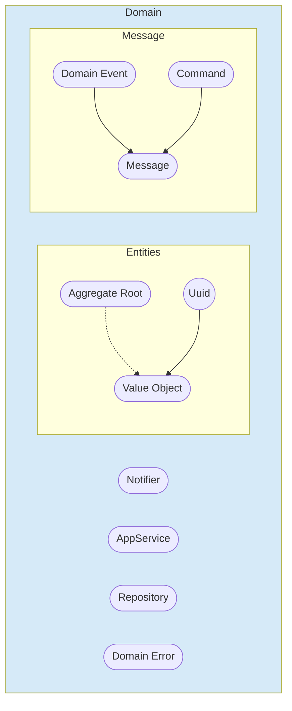

`petisco 🍪` is a framework which helps you to model you domain. 



Continuing with the Task Manager example (see [Getting Started](getting_started.md)), let's see some examples of domain entities and models that can help you.

## Entities

### UUID

Use `Uuid` to generate new identifiers.

```python
from petisco import Uuid
uuid = Uuid.v4()
```

Additionally, you can extend it:

```python
from petisco import Uuid

class TaskId(Uuid): ...

task_id = TaskId.v4()
```

### Value Objects

Create your Value Objects extending from `ValueObject` base class.

```python
from pydantic import validator
from meiga import Failure
from petisco import ValueObject, DomainError

class EmptyValueObjectError(DomainError): ...
class ExceedLengthLimitValueObjectError(DomainError): ...

def ensure_not_empty_value(value, classname: str = None):
    if value is None:
        raise Failure(EmptyValueObjectError(classname))


def ensure_value_is_less_than_200_char(value):
    if len(value) > 200:
        raise ExceedLengthLimitValueObjectError(value)


class Description(ValueObject):

    @validator('value')
    def validate_value(cls, value):
        ensure_not_empty_value(value, cls.__name__)
        ensure_value_is_less_than_200_char(value)
        return value.title()
```

### Aggregate Root


!!! quote

    As Evans define:

    "An AGGREGATE is a cluster of associated objects that we treat as a unit for the purpose of data changes. 
    Each AGGREGATE has a root and a boundary. The boundary defines what is inside the AGGREGATE. 
    The root is a single, specific ENTITY contained in the AGGREGATE."

    ...

    "The root is the only member of the AGGREGATE that outside objects are allowed to hold references to[.]"


To define your data model, just extend from `AggregateRoot` to obtain useful features.
 
```python
from petisco import AggregateRoot
from datetime import datetime

from my_app import Description, TaskCreated, TaskId, Title

class Task(AggregateRoot):
    title: Title  # <== ValueObject
    description: Description # <== ValueObject
    created_at: datetime

    @staticmethod
    def create(task_id: TaskId, title: Title, description: Description):
        task = Task(aggregate_id=task_id, title=title, description=description, created_at=datetime.utcnow())
        task.record(TaskCreated(task_id=task_id))
        return task
```

Define a name constructor as the static method `create` to simplify the construction and the record of the domain events
related with the Task `AggregateRoot`.

Then, you can get all the event with `pull_domain_events`.

```python
task = Task.create(
    task_id=TaskId.v4(),
    title="petisco",
    description="Learning petisco is nice!"
)
domain_events = task.pull_domain_events() # This will return a list of DomainEvents ([TaskCreated(task_id=task_id)])
```

## Messaging


### Domain Event

Use `DomainEvent` to model the actions of our domain that are of interest to our business logic.

```python
from petisco import DomainEvent, Uuid

class TaskId(Uuid): ...

class TaskCreated(DomainEvent):
    task_id: TaskId

class TaskRemoved(DomainEvent):
    task_id: TaskId

class TaskRetrieved(DomainEvent):
    task_id: TaskId
```

`DomainEvent` inherits from `Message` that have available `dict` and `json` method to encode the info.

```python
my_domain_event = TaskCreated(task_id=TaskId.v4())

print(my_domain_event.json())
```

The result should be something like the following:
```json
{
    "data": {
        "id": "3a4d78aa-6870-41cb-aa14-964831511d86",
        "type": "task.created",
        "type_message": "domain_event",
        "version": 1,
        "occurred_on": "2021-12-28 14:11:47.845618",
        "attributes": {"task_id": "a7f8b62a-c9e5-4f3c-a451-47cd1965958f"},
        "meta": {},
    }
}
```

`attributes` is a representation of the class:

```python
class TaskCreated(DomainEvent):
    task_id: TaskId
```

You can also add metadata to your domain event payload

```python
domain_event =  TaskCreated(task_id=TaskId.v4()).add_meta({"correlation_id": "d8ed76aa-2fce-48f2-9470-ec5048783fe1"})
```

The result is:

```json
{
    "data": {
        "id": "3a4d78aa-6870-41cb-aa14-964831511d86",
        "type": "task.created",
        "type_message": "domain_event",
        "version": 1,
        "occurred_on": "2021-12-28 14:11:47.845618",
        "attributes": {"task_id": "a7f8b62a-c9e5-4f3c-a451-47cd1965958f"},
        "meta": {"correlation_id": "d8ed76aa-2fce-48f2-9470-ec5048783fe1"} # <== Added meta info
    }
}
```

### Command 

If you use CQRS you can use also the `Command` class. Extend from it when you want to model an imperative action to be done.

```python
from petisco import Command, Uuid

class TaskId(Uuid): ...

class UpdateTask(Command):
    task_id: TaskId

my_command = UpdateTask(task_id=TaskId.v4())

print(my_command.json())
```

The result:

```json
{
    "data": {
        "id": "1f35e414-0636-4983-987e-13d522749709",
        "type": "update.task",
        "type_message": "command",
        "version": 1,
        "occurred_on": "2021-12-28 14:19:09.149651",
        "attributes": {"task_id": "db0970be-f6b6-478b-976a-f83e85112b90"},
        "meta": {},
    }
}
```

## Other Domain Elements

### Domain Error

Model your domain errors extending from `DomainError`:

```python
from petisco import DomainError

class TaskAlreadyExistError(DomainError): ...
class TaskNotFoundError(DomainError): ...
```

You can add additional information to `DomainError` objects using `additional_info` argument:

```python
domain_error = TaskNotFoundError(additional_info={"error": "detail"})
```

or also you can add related uuid with 

```python
domain_error = TaskNotFoundError(uuid_value=task_id.value, additional_info={"error": "detail"})
```

!!! note
    
    `petisco` provides some default errors such as `UnknownError` and `CriticalError`.

    Additionally, the framework defines `DEFAULT_HTTP_ERROR_MAP` with some default errors and its correspondences with
    `HttpErrors`.

    ```python
    DEFAULT_HTTP_ERROR_MAP = {
        DomainError: HttpError(status_code=500),
        NotFound: HttpError(status_code=404),
        AlreadyExists: HttpError(status_code=409),
        AggregateNotFoundError: HttpError(status_code=404),
        AggregatesNotFoundError: HttpError(status_code=404),
        AggregateAlreadyExistError: HttpError(status_code=409),
        ClientNotFound: HttpError(status_code=404),
        ClientAlreadyExists: HttpError(status_code=409),
        UserNotFound: HttpError(status_code=404),
        UserAlreadyExists: HttpError(status_code=409),
        InvalidUuid: HttpError(status_code=422),
        InvalidValueObject: HttpError(status_code=500),
    }
    ```

### Notifier

Implement your notifier inheriting from `Notifier`.

```python
from petisco import Notifier, NotifierMessage, NotifierExceptionMessage

class MyDummyNotifier(Notifier):
   
    def publish(self, notifier_message: NotifierMessage):
        print(f"Publishing {notifier_message}")
        
      def publish_exception(self, notifier_exception_message: NotifierExceptionMessage):
            print(f"Publishing exeception {notifier_exception_message}")
```

### AppServices 

Implement your app services inheriting from `AppService`.

```python
from petisco import AppService

class MyDummyAppService(AppService):
   
    def execute(self, input_param: str):
        # Add your code here
```

### Repositories

Implement your repositories inheriting from `Repository`. This interface do not expose any abstract method, so you can 
extend it as you want.

```python
from petisco import Repository
from my_app import TaskId

class MyDummyRepository(Repository):
   
    def retrieve(self, task_id: TaskId):
        task = task_from_task_id(task_id)
        return task
```

??? example "Example with CRUD Repository"

    Otherwise, if you want to model a repository for a CRUD application, you can inherit from `CrudRepository`

    ```python
    from typing import Any, Dict, List
    
    from meiga import BoolResult, Error, Failure, Result, Success, isSuccess, early_return
    
    from petisco.base.application.patterns.crud_repository import (
        AggregateRootType,
        CrudRepository,
    )
    from petisco.base.domain.errors.defaults.already_exists import (
        AggregateAlreadyExistError,
    )
    from petisco.base.domain.errors.defaults.not_found import AggregateNotFoundError
    from petisco.base.domain.model.uuid import Uuid
    
    
    class InmemoryCrudRepository(CrudRepository[AggregateRootType]):
        def __init__(self):
            self._data: Dict[Uuid, Any] = dict()
    
        @early_return
        def save(self, aggregate_root: AggregateRootType) -> BoolResult:
            if aggregate_root.aggregate_id in self._data:
                return Failure(AggregateAlreadyExistError(aggregate_root.aggregate_id))
            self._data[aggregate_root.aggregate_id] = aggregate_root
            return isSuccess
    
        @early_return
        def retrieve(self, aggregate_id: Uuid) -> Result[AggregateRootType, Error]:
            aggregate_root = self._data.get(aggregate_id)
            if aggregate_root is None:
                return Failure(AggregateNotFoundError(aggregate_id))
            return Success(aggregate_root)
    
        def update(self, aggregate_root: AggregateRootType) -> BoolResult:
            if aggregate_root.aggregate_id not in self._data:
                return Failure(AggregateNotFoundError(aggregate_root.aggregate_id))
            self._data[aggregate_root.aggregate_id] = aggregate_root
            return isSuccess
    
        def remove(self, aggregate_id: Uuid) -> BoolResult:
            if aggregate_id not in self._data:
                return Failure(AggregateNotFoundError(aggregate_id))
            self._data.pop(aggregate_id)
            return isSuccess
    
        def retrieve_all(self) -> Result[List[AggregateRootType], Error]:
            return Success(list(self._data.values()))
    ```