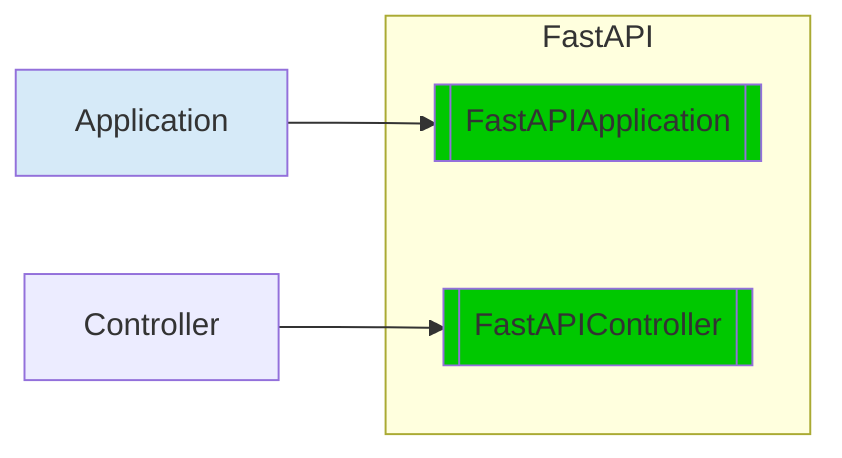

<div class="termy">
```console
$ pip install petisco[fastapi]
---> 100%
Successfully installed petisco
```
</div>

When you install `petisco` with `fastapi` you can use `FastAPIApplication` and `FastAPIController`



!!! note

    The following examples are extracted from the project [petisco-fastapi-example](https://github.com/alice-biometrics/petisco-fastapi-example).

## FastAPIApplication

```python
import os

from elasticapm.contrib.starlette import ElasticAPM, make_apm_client
from fastapi import FastAPI
from petisco.extra.fastapi import FastApiApplication
from starlette.middleware.cors import CORSMiddleware

from app import (
    APPLICATION_LATEST_DEPLOY,
    APPLICATION_NAME,
    APPLICATION_VERSION,
    ENVIRONMENT,
    ORGANIZATION,
)
from app.api import checks, tasks
from app.api.openapi import FASTAPI_PREFIX, OPENAPI_TAGS
from app.petisco.dependencies import dependencies_provider


def fastapi_configurer() -> FastAPI:
    def configure_apm(app):
        apm_config = {
            "SERVICE_NAME": APPLICATION_NAME,
            "SERVER_URL": os.environ.get("ELASTIC_APM_SERVER_HOST"),
            "SECRET_TOKEN": os.environ.get("ELASTIC_APM_SECRET_TOKEN"),
            "ENVIRONMENT": ENVIRONMENT,
        }
        apm = make_apm_client(apm_config)
        app.add_middleware(ElasticAPM, client=apm)

    docs_url = f"{FASTAPI_PREFIX}/docs"
    app = FastAPI(
        title=APPLICATION_NAME,
        openapi_tags=OPENAPI_TAGS,
        docs_url=docs_url,
        openapi_url=f"{FASTAPI_PREFIX}/openapi.json",
    )
    app.include_router(checks.router, prefix=FASTAPI_PREFIX)
    app.include_router(tasks.router, prefix=FASTAPI_PREFIX)

    app.add_middleware(
        CORSMiddleware, allow_origins=["*"], allow_methods=["*"], allow_headers=["*"]
    )
    apm_enabled = ENVIRONMENT in ["production", "staging"]
    if apm_enabled:
        configure_apm(app)

    return app


application = FastApiApplication(
    name=APPLICATION_NAME,
    version=APPLICATION_VERSION,
    organization=ORGANIZATION,
    deployed_at=APPLICATION_LATEST_DEPLOY,
    dependencies_provider=dependencies_provider,
    fastapi_configurer=fastapi_configurer,
)
```

#### Ensure that all FastAPI entry point are `async`

In some applications you want to ensure all FastAPI routers are defined as `async`. You can force this with the 
parameter `ensure_async_routers`.


```python hl_lines="8"
application = FastApiApplication(
    name=APPLICATION_NAME,
    version=APPLICATION_VERSION,
    organization=ORGANIZATION,
    deployed_at=APPLICATION_LATEST_DEPLOY,
    dependencies_provider=dependencies_provider,
    fastapi_configurer=fastapi_configurer,
    ensure_async_routers=True
)
```
    
#### Add a mock response guided by headers

The main idea here is to add a FastAPI dependency to all the defined routers in order to check specific header (By default `X-Mock-Reponse-Status-Code`).
This dependency will check given value through request headers returning defined status code. 


## FastAPIController

```python
from meiga import Result, Error
from petisco import Container
from petisco.extra.fastapi import FastAPIController

from app.src.task.create.application.task_retriever import TaskRetriever
from app.src.task.shared.domain.task import Task


class GetTaskController(FastAPIController):
    def execute(self, task_id: UUID) -> Result[Task, Error]:
        task_retriever = TaskRetriever(
            repository=Container.get(TaskRepository),
            domain_event_bus=Container.get(DomainEventBus),
        )
        return task_retriever.execute(task_id)
```

## FastAPI Example

Continuing with example described above (`GetTaskController`), this is how a petisco controller should be integrated
in a FastAPI application.

```python
from fastapi import FastAPI
from petisco.extra.fastapi import as_fastapi

app = FastAPI()


@app.get("/task")
def get_task(task_id: UUID):
    result = GetTaskController().execute(task_id)
    return as_fastapi(result)
```

We can also use some covinent tools given by FastAPI and petisco to better document and write your application giving a 
better experience to your users and developers. 

```python 
from fastapi import FastAPI
from petisco.extra.fastapi import as_fastapi

app = FastAPI()


@app.get(
    "/task",
    summary="Return a task from a given task_id",
    description="Return a task from a given task_id. If not exist it will return an error.",
    responses=GetTaskController.responses() # (1)
)
def get_task(task_id: UUID) -> Task: # (2)
    result = GetTaskController()
    return as_fastapi(result, expected_type=Task)
```

1. Use `responses()` method from `FastAPIController` to get defined error_map in FastAPI format.
2. Define return Model.
