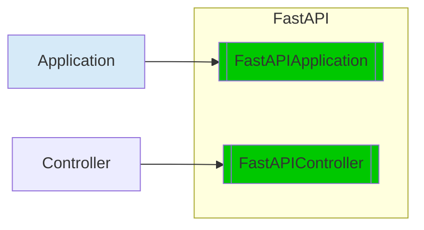

<div class="termy">
```console
$ pip install petisco[fastapi]
---> 100%
Successfully installed petisco
```
</div>

When you install `petisco` with `fastapi` you can use `FastAPIApplication` and `FastAPIController`



!!! note

    The following examples are extracted from the project [petisco-fastapi-example](https://github.com/alice-biometrics/petisco-fastapi-example).

## FastAPIApplication

```python
import os

from elasticapm.contrib.starlette import ElasticAPM, make_apm_client
from fastapi import FastAPI
from petisco.extra.fastapi import FastApiApplication
from starlette.middleware.cors import CORSMiddleware

from app import (
    APPLICATION_LATEST_DEPLOY,
    APPLICATION_NAME,
    APPLICATION_VERSION,
    ENVIRONMENT,
    ORGANIZATION,
)
from app.api import checks, tasks
from app.api.openapi import FASTAPI_PREFIX, OPENAPI_TAGS
from app.petisco.dependencies import dependencies_provider


def fastapi_configurer() -> FastAPI:
    def configure_apm(app):
        apm_config = {
            "SERVICE_NAME": APPLICATION_NAME,
            "SERVER_URL": os.environ.get("ELASTIC_APM_SERVER_HOST"),
            "SECRET_TOKEN": os.environ.get("ELASTIC_APM_SECRET_TOKEN"),
            "ENVIRONMENT": ENVIRONMENT,
        }
        apm = make_apm_client(apm_config)
        app.add_middleware(ElasticAPM, client=apm)

    docs_url = f"{FASTAPI_PREFIX}/docs"
    app = FastAPI(
        title=APPLICATION_NAME,
        openapi_tags=OPENAPI_TAGS,
        docs_url=docs_url,
        openapi_url=f"{FASTAPI_PREFIX}/openapi.json",
    )
    app.include_router(checks.router, prefix=FASTAPI_PREFIX)
    app.include_router(tasks.router, prefix=FASTAPI_PREFIX)

    app.add_middleware(
        CORSMiddleware, allow_origins=["*"], allow_methods=["*"], allow_headers=["*"]
    )
    apm_enabled = ENVIRONMENT in ["production", "staging"]
    if apm_enabled:
        configure_apm(app)

    return app


application = FastApiApplication(
    name=APPLICATION_NAME,
    version=APPLICATION_VERSION,
    organization=ORGANIZATION,
    deployed_at=APPLICATION_LATEST_DEPLOY,
    dependencies_provider=dependencies_provider,
    fastapi_configurer=fastapi_configurer,
)
```

## FastAPIController

```python
from meiga import BoolResult
from petisco import Container
from petisco.extra.fastapi import FastAPIController

from app.src.task.create.application.task_creator import TaskCreator
from app.src.task.shared.domain.task import Task


class CreateTaskController(FastAPIController):
    def execute(self, task: Task) -> BoolResult:
        task_creator = TaskCreator(
            labeler=Container.get(TaskLabeler),
            repository=Container.get(TaskRepository),
            domain_event_bus=Container.get(DomainEventBus),
        )
        return task_creator.execute(task=task)
```