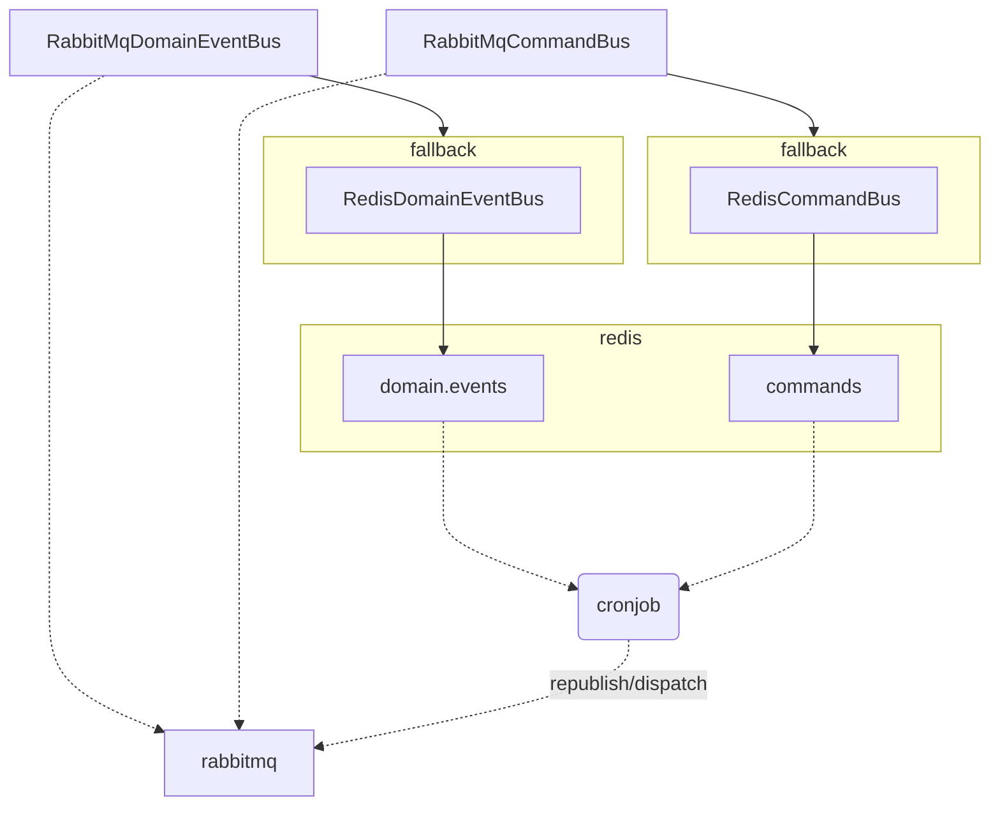

<div class="termy">
```console
$ pip install petisco[redis]
---> 100%
Successfully installed petisco
```
</div>

This page is an overview of how petisco helps us on Message Broker development using Redis as message publishers.

## RedisDomainEventBus

The `RedisDomainEventBus` saves with *LPUSH* published events.

!!! example

    ```python
    from petisco.extra.redis import RedisDomainEventBus
    from redis.client import Redis    

    organization = "acme"
    service = "petisco"
    redis = Redis()

    domain_event_bus = RedisDomainEventBus(organization, service, redis)
    ```

## RedisCommandsBus

The `RedisCommandBus` saves with *LPUSH* dispatched commands.

!!! example

    ```python
    from petisco.extra.redis import RedisCommandBus
    from redis.client import Redis    

    organization = "acme"
    service = "petisco"
    redis = Redis()

    command_bus = RedisCommandBus(organization, service, redis)
    ```

## Working as a fallback of RabbitMQ

This Redis implementation could be very interesting to work as a fallback of RabbitMQ implementation. This helps to 
make the system more reliable by saving in Redis the messages that rabbitmq cannot publish.



!!! example

    ```python
    from petisco.extra.rabbitmq import RabbitMqDomainEventBus, RabbitMqCommandBus
    from petisco.extra.redis import RedisDomainEventBus, RedisCommandBus
    from redis.client import Redis    

    organization = "acme"
    service = "petisco"
    
    # Redis
    redis = Redis()
    fallback_domain_event_bus = RedisDomainEventBus(organization, service, redis)
    fallback_command_bus = RedisCommandBus(organization, service, redis)

    # RabbitMq
    rabbitmq_connector = RabbitMqConnector()
    domain_event_bus = RabbitMqDomainEventBus(organization, service, rabbitmq_connector, fallback=fallback_domain_event_bus)
    command_bus = RabbitMqCommandBus(organization, service, rabbitmq_connector, fallback=fallback_command_bus)
    ```