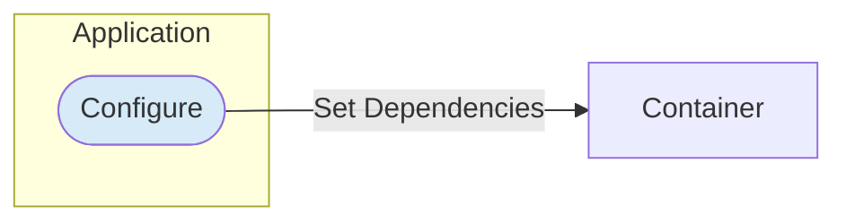
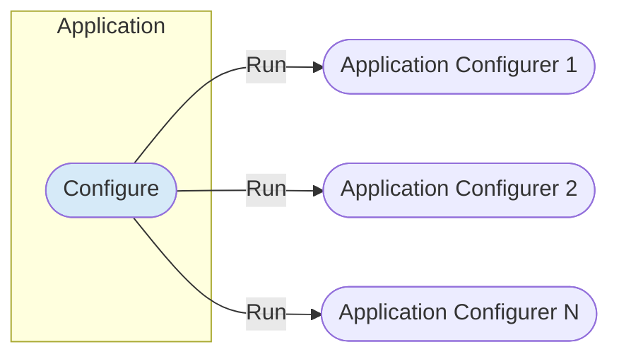
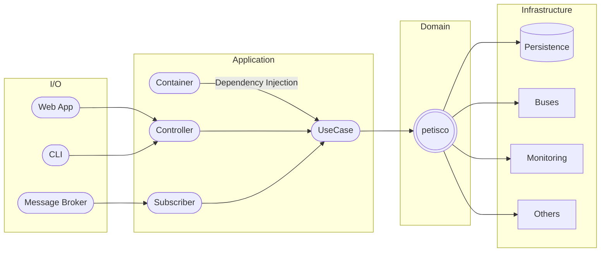

This package helps on the creation of web applications. `petisco` provides several classes to help model the domain and 
manage the lifecycle of applications with a hexagonal architecture. In addition, it provides abstractions to extend with
your infrastructure details.

!!! note "Versions"
    First version of `petisco` (v0) born quite coupled to [Flask](https://flask.palletsprojects.com/en/2.2.x/) web framework.
    Now, `petisco` v1 is not coupled to any web framework. Nevertheless, the package provides some examples and useful tool to 
    speed up the integration with the awesome [FastAPI](https://fastapi.tiangolo.com/) framework.

## Application

!!! note ""

    The `Application` class defines the starting point of your web application. This class allows you to configure your 
    application, and prepare it to start responding to requests.


The following code is the minimum to define and configure an application:

```python
from petisco import Application
from datetime import datetime

application = Application(
    name="my-app",
    version="1.0.0",
    organization="acme",
    deployed_at=str(datetime.utcnow()),
    environment="staging",

)
application.configure()
```

Since no dependencies or configurators have been added, running `configure` will have no side effects.

#### Define your Dependencies 🎯



You can define your dependencies adding a callable (dependencies_provider - `Optional[Callable[..., List[Dependency]]]`).

```python
from petisco import (
    Application,
    Dependency,
    Builder,
    InmemoryCrudRepository,
    AggregateRoot,
)
from datetime import datetime

class Task(AggregateRoot): ...

# Class to define your dependencies 🎯
def dependencies_provider() -> list[Dependency]:
    dependencies = [
        Dependency( 
            name="task_repository",
            default_builder=Builder(InmemoryCrudRepository[Task])
        )
    ]
    return dependencies


application = Application(
    name="my-app",
    version="1.0.0",
    organization="acme",
    deployed_at=str(datetime.utcnow()),
    environment="staging",
    dependencies_provider=dependencies_provider,  # <==== Adding dependencies ➕
)
application.configure()
```

When call `configure` method, dependencies will be checked and added to the `Container` of dependencies being ready to be consumed
to inject them to the use cases.

???+ tip

    Different implementations can be specified for each `Dependency`, depending on environment variables.
    
    ```python
    from petisco import (
        Dependency,
        Builder,
        InmemoryCrudRepository,
        AggregateRoot
    )
    from my_app import FolderTaskCrudRepository, MySQLTaskCrudRepository, ElasticTaskCrudRepository
    
    class Task(AggregateRoot): ...
    
    def dependencies_provider() -> list[Dependency]:
        dependencies = [
            Dependency( 
                name="task_repository",
                default_builder=Builder(InmemoryCrudRepository[Task]), # <== default implementation 
                envar_modifier="TASK_REPOSITORY_TYPE", # <== env variable acts as modificator
                builders={
                    "folder": Builder(
                        FolderTaskCrudRepository, folder="folder_task_database" # Here we have to add required parameter on the implementation constructor
                    ),
                    "mysql": Builder(
                        MySQLTaskCrudRepository, connection="whatever required" # Here we have to add required parameter on the implementation constructor
                    ),
                    "elastic": Builder(
                        ElasticTaskCrudRepository, connection="whatever required" # Here we have to add required parameter on the implementation constructor
                    )
                },
            )
        ]
        return dependencies
    ```

    When envar `TASK_REPOSITORY_TYPE` is not defined, default implementation is `InmemoryCrudRepository`.
    When `TASK_REPOSITORY_TYPE` has a valid value (available as a key in the `builders` dictation) the implementation 
    will be changed. These are the options configured in the `builders` dictionary :

    * `FolderTaskCrudRepository`
    * `MySQLTaskCrudRepository`
    * `ElasticTaskCrudRepository`

#### Add Application Configurers 🛠️



Extend from `ApplicationConfigurer` to model some logics you want to be executed at application startup. For example, 
use it to initialize some repository, to configure your persistence, subscribers, etc.

???+ example
    
    ```python
    from petisco import (
        Application,
        ApplicationConfigurer,
        AggregateRoot,
        Container
    )
    from datetime import datetime
    
    class Task(AggregateRoot): 
        name: str
        description: str
    
    # Configurer to add tasks to a specific repository (e.g. to init a tutorial)
    class AddTasksForTutorialApplicationConfigurer(ApplicationConfigurer):
        def __init__(self, tasks: list[Task]):
            self.tasks = tasks
            execute_after_dependencies = True
            super().__init__(execute_after_dependencies)
    
        def execute(self, testing: bool = False) -> None:
            repository = Container.get("task_repository")
            for task in self.tasks:
                repository.save(task)
            
    configurers = [
        AddTasksForTutorialApplicationConfigurer(
            tasks=[Task(name="petisco", description="Learning petisco is nice!")]
        )
    ]
    
    application = Application(
        name="my-app",
        version="1.0.0",
        organization="acme",
        deployed_at=str(datetime.utcnow()),
        environment="staging",
        configurers=configurers,  # <==== Adding your configurers ➕
    )
    application.configure()
    ```

???+ tip "Use `testing` parameter"

    You can define diferent behaivor for testing environment using `testing` both in `ApplicationConfigurers` and `Application.configure` method.

    ```python
    import os
    from petisco import (
        Application,
        ApplicationConfigurer,
        AggregateRoot,
        Container
    )
    from datetime import datetime
    
    class Task(AggregateRoot): 
        name: str
        description: str
    
    # Configurer to perform an action only in testing
    class OnlyTestingApplicationConfigurer(ApplicationConfigurer):
        def __init__(self):
            execute_after_dependencies = True
            super().__init__(execute_after_dependencies)
    
        def execute(self, testing: bool = False) -> None:
            if not testing:
                return
            
            notifier = Container.get("notifies")
            notifier.send_message("Message to Github Actions")
            
    configurers = [
        OnlyTestingApplicationConfigurer(
            tasks=[Task(name="petisco", description="Learning petisco is nice!")]
        )
    ]
    
    application = Application(
        name="my-app",
        version="1.0.0",
        organization="acme",
        deployed_at=str(datetime.utcnow()),
        environment="staging",
        configurers=configurers,  # <==== Adding your configurers ➕
    )

    testing = strtobool(os.getenv("TESTING", "false"))
    application.configure(testing)
    ```

#### Other methods 👌

The `Application` class also provides some useful methods as shown in the following table.

| Method                                             | Definition                                                                         | 
|----------------------------------------------------|:-----------------------------------------------------------------------------------| 
| `get_dependencies()`                               | Return a list of set dependencies                                                  | 
| `clear()`                                          | Clear set dependencies                                                             |  
| `info()`                                           | Returns a json with information of the application and its configured dependencies |
| `publish_domain_event(domain_event: DomainEvent)`  | Publish a domain event using configured `DomainEventBus` dependency                |  
| `notify(message: NotifierMessage)`                 | Notify a message using configured `Notifier` dependency                      |
| `was_deploy_few_minutes_ago(minutes: int = 25)`    | Useful to decide some notification depending on when was the application deployed  |


### FastApiApplication ⚡️

`FastApiApplication` inherits from `Application` adding some specifications to work with FastAPI web framework. 
This specification is as simple as:

```python
from typing import Callable

from fastapi import FastAPI

from petisco.base.application.application import Application


class FastApiApplication(Application):
    fastapi_configurer: Callable[[], FastAPI]

    def get_app(self) -> FastAPI:
        return self.fastapi_configurer()
```

Adding a callable to configure FastAPI object (`fastapi_configurer`).


```python hl_lines="12"
from petisco.extra.fastapi import FastApiApplication

...

application = FastApiApplication(
    name="my-app",
    version="1.0.0",
    organization="acme",
    deployed_at=str(datetime.utcnow()),
    dependencies_provider=dependencies_provider,
    configurers=configurers,
    fastapi_configurer=fastapi_configurer, # (1)
)
```

1. Function to initialize `FastAPI` object. 
   
   Example:

    ```python
    from fastapi import FastAPI
   
    ...

    def fastapi_configurer() -> FastAPI:
        def configure_apm(app):
            apm_config = {
                "SERVICE_NAME": APPLICATION_NAME,
                "SERVER_URL": os.environ.get("ELASTIC_APM_SERVER_HOST"),
                "SECRET_TOKEN": os.environ.get("ELASTIC_APM_SECRET_TOKEN"),
                "ENVIRONMENT": ENVIRONMENT,
            }
            apm = make_apm_client(apm_config)
            app.add_middleware(ElasticAPM, client=apm)
    
        docs_url = f"{FASTAPI_PREFIX}/docs"
        app = FastAPI(
            title=APPLICATION_NAME,
            openapi_tags=OPENAPI_TAGS,
            docs_url=docs_url,
            openapi_url=f"{FASTAPI_PREFIX}/openapi.json",
        )
        app.include_router(checks.router, prefix=FASTAPI_PREFIX)
        app.include_router(tasks.router, prefix=FASTAPI_PREFIX)
    
        app.add_middleware(
            CORSMiddleware, allow_origins=["*"], allow_methods=["*"], allow_headers=["*"]
        )
        apm_enabled = ENVIRONMENT in ["production", "staging"]
        if apm_enabled:
            configure_apm(app)
    
        return app
    ```
   
???+ tip

    Check the architecture of a `petisco` + `FastAPI` web application in GitHub with the project [petisco-fastapi-example](https://github.com/alice-biometrics/petisco-fastapi-example).


## Architecture

Once we have seen how the application is initialized, we can review which the architecture of `petisco` framework.
The following diagram represent some entities into four layers:



* **I/O**: Represents the entry point of your application. It could be the requests from the API, messages from a 
  message broker or commands from a CLI.
* **Application**: Objects to define and manage the busines logic of your application.
* **Domain**: Entities of your domain. This models defines tha application actors. As well as domain abstraction for 
  Application Services and Repositories.
* **Infrastructure**: Real implementation of domain abstraction to connect your application with external technology. 
  For example, integration with MySQL, RabbitMQ, Redis, etc.

In the next sections we will start by reviewing the objects in charge of managing the application layer, then we will 
review the domain layer, and finally we will review the extra infrastructure implementations that are available in the 
package.