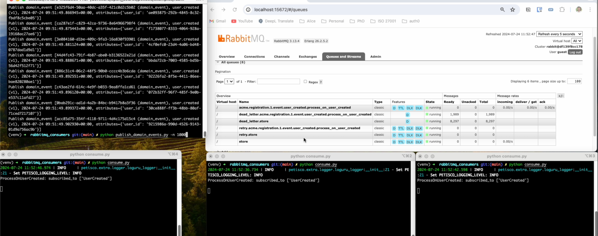

This tutorial provides a hands-on environment to explore the workings and scalability of consumer systems.
The following steps will guide you through setting up and running the code, allowing you to see how consumers can be
managed and scaled in practice.


To get started, navigate to the relevant directory and run the configuration script:

```console
cd examples/rabbitmq_consumers
python configure.py
```

In separate terminal windows, start the consumer processes:

```console
cd examples/rabbitmq_consumers
python consume.py
```

Also in other terminal:
```console
cd examples/rabbitmq_consumers
python consume.py
```

Once the consumers are running, you're ready to execute the `publish_domain_events.py` script to observe how the system
handles events.

```console
cd examples/rabbitmq_consumers
python publish_domain_events.py -n 1000
```



